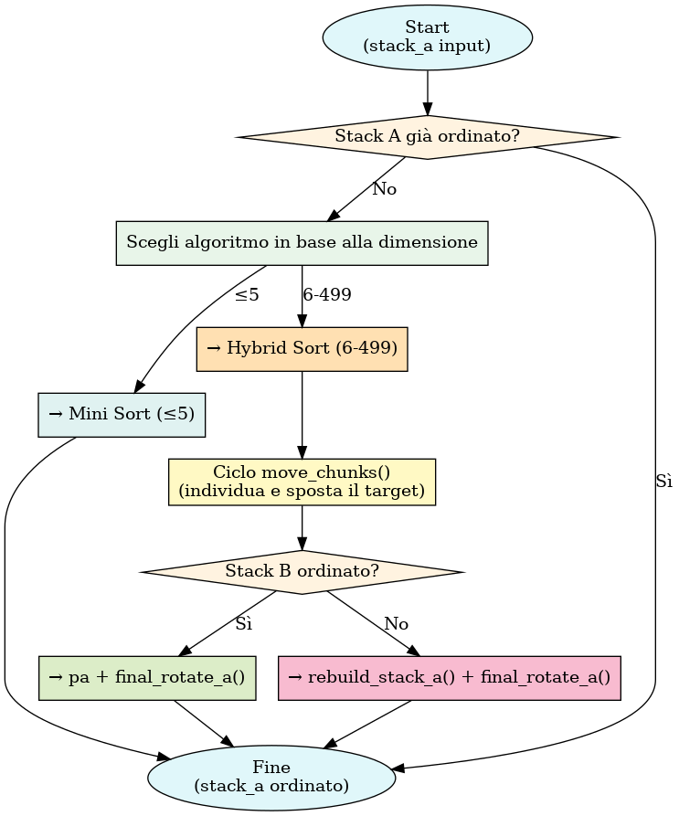
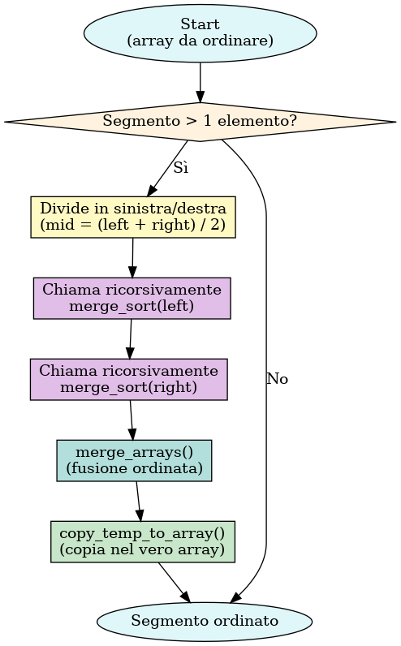
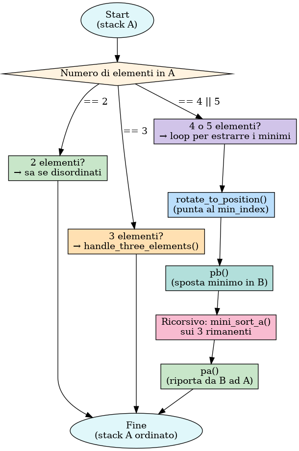
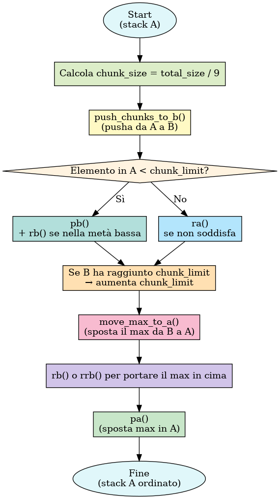
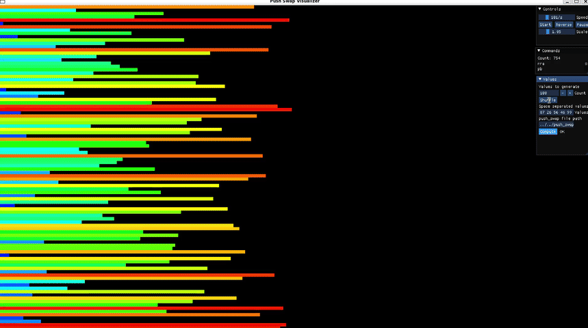

# 🚀 Push-Swap

[](https://github.com/vhacman/push_swap)
[](https://en.wikipedia.org/wiki/C_(programming_language))
[](https://github.com/42School/norminette)
[](https://valgrind.org/)
[]()
[]()
[]()
[]()

---
## 📚 Indice
- [📖 Descrizione](#descrizione)
- [📁 Architettura del Progetto](#architettura-del-progetto)
- [🔎 Algoritmi Principali](#algoritmi-principali)
  - [🌀 Hybrid Sort](#hybrid-sort)
  - [🧠 Merge Sort](#merge-sort)
  - [🔧 Mini Sort](#mini-sort)
  - [🚀 Ultra Chunk Sort](#ultra-chunk-sort)
- [🔍 Funzioni Principali](#funzioni-principali)
- [🛠️ Build](#build)
- [🧑‍💻 Contatti](#contatti)
---
# Descrizione
L’obiettivo principale è scrivere un programma che, dato un input con numeri interi (stack a) e partendo da uno stack b vuoto, calcoli e visualizzi la     sequenza minima di operazioni necessarie per ordinare stack a in ordine ascendente.

## Input e Validazione:
Il programma riceve una lista di numeri interi come argomenti e, attraverso funzioni dedicate (come quelle viste in validate_input.c), verifica la correttezza dell’input, gestendo errori quali valori non numerici, duplicati o numeri fuori dai limiti.

## Assegnazione degli Indici:
Utilizzando tecniche di ordinamento (ad esempio, merge sort implementato in merge_algorithm.c) si converte lo stack in un array ordinato, assegnando a ciascun nodo un indice corrispondente alla sua posizione nell’ordine crescente .

## 📐 Strategie di Ordinamento 📐
Per numeri di piccole dimensioni si impiegano algoritmi semplificati (come in mini_sort_a.c), mentre per dataset più grandi vengono utilizzati approcci ibridi o a chunk (vedi hybrid_sort.c e ultra_chunk_sort.c) per minimizzare il numero di operazioni, con ulteriori ottimizzazioni attraverso il calcolo del “costo” delle mosse (gestito in cost_utils.c e execute_optimal_moves.c).

## Esecuzione delle Operazioni:
Le funzioni implementate per eseguire operazioni di base (swap, push, rotate, reverse rotate) e le loro versioni doppie (in stack_double_operations.c e double_operations.c) manipolano le pile per spostare e ordinare gli elementi.
---
# Architettura del Progetto
```bash
push_swap/
├── include/
│   └── push_swap.h                # Header principale: struct, prototype, define generici
├── main/
│   └── main.c                     # Entry point: inizializza, seleziona algoritmo, libera stack
├── src/
│   ├── algorithms/
│   │   ├── hybrid_sort.c          # Ordinamento per ≤500 numeri (chunk dinamici, greedy)
│   │   ├── merge_algorithm.c      # Merge Sort: ordinamento array temporaneo per gli indici
│   │   ├── mini_sort_a.c          # Ordinamento per 2–5 elementi (rotazioni manuali)
│   │   └── ultra_chunk_sort.c     # Ordinamento ottimizzato per ≥500 numeri (chunk statici)
│   │
│   ├── error_handling/                     
│   │   ├── controls.c             # Controlli extra (es. is_sorted, is_valid, ecc.)
│   │   ├── error.c                # Gestione errori critici e exit
│   │   ├── free.c                 # Funzioni per liberare stack, array, costi, ecc.
│   │   └── validate_input.c       # Parsing input, gestione duplicati, overflow, caratteri non numerici
│   │
│   ├── execute_optimal_moves/
│   │   └── execute_optimal_moves.c  # Rotazioni combinate (rr, rrr), push intelligente
│   │
│   ├── libft/
│   │   ├── includes               # Header della libft
│   │   ├── src/                   # Tutti i file implementativi della libft
│   │   └──── ...                  # Es. ft_split.c, ft_atoi.c, ft_strlen.c
│   │ 
│   ├── utils/
│   │   └── debug_functions/
│   │       └── debug.c            # Stampa stato degli stack, indici, informazioni di debug
│   │
│   ├── stack_operations/         
│   │   └── print_operations/
│   │   │   ├── print_push_print_swap.c        # Stampa `sa`, `sb`, `pa`, `pb`
│   │   │   ├── print_rotate_print_rrotate.c   # Stampa `ra`, `rb`, `rra`, `rrb`
│   │   │   └── print_stack_double_operations.c# Stampa `ss`, `rr`, `rrr`
│   │   │
│   │   ├── stack_double_operations.c # Esecuzione di `ss`, `rr`, `rrr` su stack reali
│   │   └── stack_operations.c        # Operazioni base `sa`, `ra`, `pb`, `pa`, ecc.
├── Makefile                          # Compilazione: definisce regole e target (`make`, `clean`, `fclean`, ecc.)
└── README.md                         # Documentazione generale del progetto

```
---
# Algoritmi principali

## Hybrid Sort

L'algoritmo usa un approccio **"ibrido"** che adatta la strategia in base alla dimensione dell’input:

🔹 **Insiemi piccoli (≤ 5 elementi)**: viene usato un ordinamento diretto (`mini_sort`).

🔸 **Insiemi medio-piccoli (da 6 a 499 elementi)**: entra in gioco `hybrid_sort`, che lavora a **chunk**.

L'idea è quella di suddividere lo stack in gruppi (chunk) e spostare gli elementi da `stack_a` a `stack_b` in modo ottimizzato, calcolando per ciascun elemento il **costo minimo di spostamento**.

### 📊 Calcolo dei costi e scelta del movimento migliore

-  `distance_to_top()` → Distanza dalla cima dello stack
-  `find_target_position_b()` → Posizione ideale nello stack B
-  `set_rotations()` → Direzione e numero di rotazioni (ra/rra, rb/rrb)
-  `calculate_move_cost()` → Calcola il costo totale delle mosse

### 🎯 Aggiornamento del target e spostamento ottimale

-  `update_if_better_target()` → Cerca il miglior candidato nel chunk corrente
-  `execute_combo_move()` → Esegue rotazioni combinate e `pb`
-  `move_chunks()` → Cicla fino a svuotare `stack_a`, aggiornando i chunk dinamicamente

### 🧱 Ricomposizione e operazioni di base

-  Se `stack_b` è ordinato → `pa` + `final_rotate_a()`
-  Altrimenti → `rebuild_stack_a()` + `final_rotate_a()`

### ⚙️ Operazioni fondamentali

-  `swap`: scambia i primi due elementi
-  `push`: sposta il primo elemento tra gli stack
-  `rotate`: primo → fondo
-  `reverse_rotate`: ultimo → in cima
-  `rr`,  `rrr`,  `ss`: rotazioni doppie
---
### 🧭 Diagramma a Blocchi – Hybrid Sort

---
## Merge Sort

L'algoritmo **Merge Sort** viene utilizzato in `push_swap` per **ordinare un array temporaneo** e assegnare correttamente gli **indici ordinati** agli elementi dello stack.

🔹 È un algoritmo ricorsivo basato sulla strategia **divide et impera**.

---
### 🔁 Suddivisione ricorsiva e fusione

- ✂ Divide l’array in due metà
-  Applica ricorsione su entrambe
-  `merge_arrays()` → fonde due sottosequenze ordinate
- `copy_temp_to_array()` → aggiorna il segmento ordinato nell’array principale

---
### 🔀 Fusione degli array ordinati

-  Confronta due sottosequenze ordinate
-  Inserisce i valori in `arr_temp`
-  Copia i rimanenti una volta terminato uno dei segmenti

---
### 📥 Copia nel vero array

-  Copia ordinata da `arr_temp` a `array`
-  Modifica solo il segmento in questione

---
### 🚪 Ingresso nell’algoritmo

-  `merge_sort()` è l’entry point
-  Alloca `arr_temp`
-  Avvia la ricorsione
-  Libera la memoria alla fine

---
### 📌 Esempio pratico

```c
int array[] = {4, 2, 5, 1, 3};
merge_sort(array, 5);
```

Risultato: `[1, 2, 3, 4, 5]`

---
### ⏱️ Complessità

-  Tempo: O(n log n)
-  Spazio: O(n)

---
### 📁 Moduli coinvolti

- `merge_algorithm.c`
  - `merge_sort()`
  - `merge_sort_recursive()`
  - `merge_arrays()`
  - `copy_temp_to_array()`

### 🧭 Diagramma a Blocchi – Merge Sort


---
##  Mini Sort

L’algoritmo **Mini Sort** è ottimizzato per gestire input molto piccoli (da 2 a 5 elementi). In questi casi, utilizzare algoritmi complessi come il merge sort o il chunking sarebbe inefficiente.

🔹 `mini_sort_a()` applica strategie diverse in base al numero di elementi presenti nello stack A, cercando di minimizzare al massimo il numero di operazioni (`sa`, `ra`, `rra`, `pb`, `pa`).

---
### 🧠 Logica decisionale per stack ≤ 3 elementi

La funzione `handle_three_elements()` analizza i primi tre valori nello stack `a`:

📊 In base alle 5 possibili combinazioni di ordine, esegue le operazioni minime necessarie per ottenere l’ordinamento crescente:

-  Caso 1: solo i primi due sono fuori ordine → `sa`
-  Caso 2: stack in ordine decrescente → `sa` + `rra`
-  Caso 3: il primo è il maggiore → `ra`
-  Caso 4: il secondo è il maggiore → `sa` + `ra`
-  Caso 5: il terzo è il più piccolo → `rra`

---
### 🔍 Ricerca del valore minimo

`find_position_of_index()`:

 Restituisce la posizione del nodo con `min_index` nello stack

 Serve a capire se conviene ruotare `ra` o `rra`

---
### 🔁 Rotazione verso la posizione

`rotate_to_position()`:

-  Ruota in avanti (`ra`) se è nella prima metà
-  Ruota indietro (`rra`) se è nella seconda

---
### ⚙️ Ordinamento per 4 o 5 elementi

1.  Ruota fino a portare il minimo in cima
2.  Sposta in `b` con `pb`
3.  Ripeti fino a lasciare solo 3 in `a`
4.  Ordina ricorsivamente i 3 elementi
5.  Riporta da `b` ad `a` con `pa`

---
### 🧭 Diagramma a Blocchi – Mini Sort



---
### 📁 Moduli coinvolti

📂 `mini_sort_a.c`

- `mini_sort_a()` → funzione principale
- `handle_three_elements()` → gestione 3 elementi
- `rotate_to_position()` → porta il minimo in cima
- `find_position_of_index()` → trova il minimo
---
## Ultra Chunk Sort

L’algoritmo **Ultra Chunk Sort** è progettato per ordinare in modo efficiente **grandi stack** (tipicamente 500 elementi), suddividendoli in **chunk** più piccoli e gestendoli strategicamente.

🔹 L'obiettivo è minimizzare il numero di operazioni dividendo i dati in blocchi gestibili e organizzando lo stack `b` per una ricostruzione ordinata e ottimale dello stack `a`.

---
### 🧠 Strategia generale

1.  **Chunking**: lo stack `a` viene suddiviso in gruppi di valori in base all’indice.
2.  `push_chunks_to_b()`:
   - Se l’indice è sotto la soglia (`current_chunk_limit`) → `pb`
   - Se è nella metà inferiore del chunk → `rb` (rotazione `b` per tenerlo basso)
   - Altrimenti → `ra` (rotazione `a` per cercare altri candidati)
   - Ogni volta che `b` supera la soglia → aumenta `chunk_limit`
      `move_max_to_a()`:
   - Trova il valore massimo in `b` → ruota `b` in modo ottimale (`rb` / `rrb`)
   - Sposta il massimo in `a` con `pa`
   - Ripeti finché `b` è vuoto

---
### 🔢 Chunk size dinamico

 Calcolato come `total_size / 9`, testato sperimentalmente per massimizzare efficienza e minimizzare mosse.

---
### 🧭 Diagramma a Blocchi – Ultra Chunk Sort



---
### 📁 Moduli coinvolti

 `ultra_chunk_sort.c`

- `ultra_chunk_sort()` → funzione principale
- `push_chunks_to_b()` → suddivisione in blocchi e push in `b`
- `move_max_to_a()` → ricostruzione dello stack `a`
- `find_max_index()` / `find_position()` → utilità per la gestione rotazioni

---
## Funzioni Principali

- `validate_input()` → parsing e controllo argomenti
- `merge_sort()` → ordina array temporaneo
- `assign_indices()` → assegna index da array ordinato a nodi
- `mini_sort_a()`, `hybrid_sort()`, `ultra_chunk_sort()` → sorting
- `execute_combo_move()` → push ottimizzato con `rr` / `rrr`
- `rotate_both()` / `rotate_individual()` → rotazioni combinate
- `rebuild_stack_a()` → ricostruisce a in ordine da b
- `final_rotate_a()` → ruota a per mettere index 0 in cima

## Build

```bash
make            # compila push_swap
make re         # ricompila da capo 
make clean      # rimuove .o
make fclean     # rimuove .o e binario
make check      # manda in run checker_linux (da implementare dopo l'evaluation)
make valgrind   # check su memory leak
```
## SORTING



# Contatti
[](https://www.linkedin.com/in/viorica-gabriela-hacman-63a412267/)
[](https://www.facebook.com/profile.php?id=100090802467237)
[](https://www.instagram.com/vgabrielah_/)

---
---

## 🤝 Contribuisci in modo rispettoso

Se trovi utile questo progetto, ti invito a non clonare direttamente la repository.

### ✨ Perché fare una fork?

Fare una **fork**:
- ti permette di avere una copia personale su cui lavorare liberamente;
- rende trasparente il tuo interesse per il progetto;
- mi aiuta a costruire un GitHub più professionale e tracciabile, mostrando quante persone hanno interagito realmente con il mio lavoro.

 In questo modo posso far crescere il mio profilo e migliorare come sviluppatrice.

### ✅ Come procedere

1. Clicca in alto a destra su **Fork**
2. Clona la tua copia con:

```bash
git clone https://github.com/<il-tuo-username>/<nome-repo>.git

```
---
