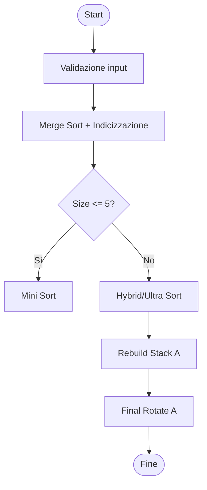

### Descrizione generale
**Push_swap** è un programma in linguaggio C il cui obiettivo è ordinare una sequenza di numeri interi usando due stack (A e B) e un numero limitato di operazioni predefinite. L'obiettivo è ottenere il minor numero di mosse possibile. Il progetto rientra nel curriculum della scuola 42 e valuta capacità di programmazione, ottimizzazione e gestione di strutture dati dinamiche.

### Obiettivi
- Ordinare efficacemente qualsiasi sequenza numerica.
- Minimizzare il numero di operazioni.
- Adattare la strategia in base alla dimensione dell'input (es. 3, 5, 100, 500 etc. numeri).

### Architettura del progetto

#### Moduli principali
| File | Responsabilità |
|------|------------------|
| main.c | Avvio del programma, inizializzazione e controllo dei flussi |
| validate_input.c | Parsing e validazione dell'input |
| assign_indices.c | Assegnazione degli indici ordinati ai valori |
| stack_utils.c | Creazione, gestione e liberazione dello stack |
| merge_algorithm.c | Algoritmo Merge Sort per ordinare una copia temporanea dello stack |
| hybrid_sort.c | Algoritmo ibrido greedy + chunk per sorting ottimizzato |
| ultra_chunk_sort.c | Strategia alternativa per grandi stack (500 numeri) |
| mini_sort_a.c | Ordinamento di stack fino a 5 elementi |
| stack_operations.c | Implementazione delle operazioni di base (sa, ra, pb, ecc.) |
| stack_double_operations.c | Operazioni doppie reali (ss, rr, rrr) |
| double_operations.c | Operazioni doppie su array fittizi |
| operations.c | Operazioni su array temporanei (astratti) |
| cost_utils.c | Calcolo dei costi delle mosse |
| execute_optimal_moves.c | Esecuzione ottimale delle mosse con combinazione di rotazioni |
| execute_utils.c | Finalizzazione ordinamento stack A, verifica ordinamento di B |
| rebuild_stack.c | Ricostruzione dello stack A da B in ordine decrescente |
| smart_pb.c | Push intelligente in B con rotazioni condizionali |
| debug.c | Stampa degli stack e degli indici per il debug |
| stack_check.c | Verifica ordinamento e stato finale |

#### Tecnologie utilizzate
- Linguaggio: C
- Compilatore: GCC
- Sistema: Unix/Linux
- Strutture dati: liste collegate
- Tool: Makefile, norminette

---

## 2. Funzionamento degli algoritmi

### Merge Sort (per assegnare indici)
1. Descrizione dell'algoritmo
Merge Sort è un algoritmo di ordinamento basato sul paradigma divide et impera (divide and conquer).

Scopo
Ordinare un array di interi in ordine crescente (può essere adattato anche per decrescente).

Problema che risolve
È particolarmente utile per ordinare array di grandi dimensioni in modo efficiente e stabile, con una complessità prevedibile.

🔁 2. Passaggi dell'algoritmo
L'algoritmo può essere suddiviso in tre fasi principali:

a) Divide (Dividi)
Si divide ricorsivamente l’array in due metà fino ad arrivare a sotto-array di un solo elemento.

b) Conquer (Risolve)
Si ordinano i sotto-array più piccoli (che sono già ordinati perché composti da un solo elemento).

c) Combine (Combina)
Si fondono i sotto-array ordinati in array più grandi ordinati.

🔍 3. Logica dell’algoritmo
Funzione: merge_sort
c
Copia
Modifica
void merge_sort(int *array, int size)
Alloca un array temporaneo arr_temp della stessa dimensione dell’array originale.

Inizializza i limiti sinistro (left = 0) e destro (right = size - 1).

Avvia la ricorsione tramite merge_sort_recursive.

Funzione: merge_sort_recursive
c
Copia
Modifica
static void merge_sort_recursive(int *array, int *arr_temp, t_range_limits limits)
Se il segmento ha più di un elemento (left < right), calcola il punto medio mid.

Richiama sé stessa per l’intervallo sinistro [left, mid] e destro [mid+1, right].

Dopo le due ricorsioni, esegue merge_arrays per unire i due sotto-array ordinati.

Copia il risultato da arr_temp ad array con copy_temp_to_array.

Funzione: merge_arrays
c
Copia
Modifica
static void merge_arrays(int *array, int *arr_temp, t_range_limits limits)
Confronta gli elementi dei due sotto-array (left...mid e mid+1...right) e li unisce in ordine crescente in arr_temp.

Funzione: copy_temp_to_array
c
Copia
Modifica
static void copy_temp_to_array(int *array, int *arr_temp, t_range_limits limits)
Copia il segmento ordinato da arr_temp ad array (tra left e right).

🧠 4. Esempio di funzionamento
Input
c
Copia
Modifica
int array[] = {4, 2, 5, 1, 3};
merge_sort(array, 5);
Fasi
Divide in: [4, 2, 5] e [1, 3]

Divide in: [4] e [2, 5]

Divide [2, 5] in: [2] e [5]

Unisce [2] + [5] → [2, 5]

Unisce [4] + [2, 5] → [2, 4, 5]

Divide [1, 3] in: [1] e [3] → Unisce → [1, 3]

Unisce [2, 4, 5] + [1, 3] → [1, 2, 3, 4, 5]

Output
c
Copia
Modifica
array = {1, 2, 3, 4, 5};
📈 5. Analisi della complessità
Tipo di complessità	Valore
Temporale	O(n log n)
Spaziale	O(n) (per l'array temporaneo)
O(log n) per la profondità della ricorsione (divisioni)

O(n) per ogni livello (fusione degli array)

🛠 6. Applicazioni dell’algoritmo
Ordinamento di grandi dataset

Ordinamenti stabili (mantiene l’ordine degli elementi uguali)

Ordinamenti in ambiente multithread (la divisione è parallelizzabile)

Utilizzato come base per algoritmi di sorting ibridi (come il tuo Hybrid Sort)

### Mini Sort (fino a 5 numeri)
- File: `mini_sort_a.c`
- Strategia:
  - 2 numeri: semplice confronto
  - 3 numeri: 5 casi possibili
  - 4-5 numeri: spostamento del minimo in B, ordinamento dei restanti, ripristino con `pa()`
- Complessità: O(n^2), ma efficiente per n piccolo

### Hybrid Sort (fino a 100-500 numeri)
- File: `hybrid_sort.c`
- Logica:
  - Divide lo stack in chunk
  - Calcola i costi di rotazione per ogni numero nel chunk
  - Seleziona il nodo con il minor numero di mosse
  - Usa `execute_combo_move()` per ottimizzare l'invio a B
  - Ricostruisce lo stack A in ordine decrescente
- Complessità: variabile, ma efficiente (circa 600 mosse su 100 numeri)

### Ultra Chunk Sort (solo per 500 numeri)
- File: `ultra_chunk_sort.c`
- Variante semplificata: non calcola costi, ma sposta per chunk

### Ricostruzione finale
- Funzione: `rebuild_stack_a()`
- Cerca il numero massimo in B e lo porta in cima per poi fare `pa()`
- Ottimizzata con rotazioni combinate `rrb`/`rb`.

### Smart PB
- Funzione: `smart_pb()`
- Effettua `pb()` e valuta se ruotare subito B in base all'indice appena spostato

---

## 3. Logica delle funzioni principali

### Esempio: `execute_combo_move()`
```c
rotate_both(a, b, &cost); // rr o rrr se possibili
rotate_individual(a, b, &cost); // ra / rra / rb / rrb
smart_pb(a, b); // push con eventuale rotazione condizionale
```

### Esempio: `assign_indices()`
```c
// Scorre ogni nodo della lista e assegna l'indice trovato nell'array ordinato
```

### Gestione errori
- Tutti i controlli input sono in `validate_input.c`
- In caso di errore: stampa "Error\n" e termina con `exit(EXIT_FAILURE)`

---

## 4. Makefile

### Target disponibili
```make
NAME = push_swap
CC = gcc
CFLAGS = -Wall -Wextra -Werror
SRC = main.c ... (tutti i file sorgente)
OBJ = $(SRC:.c=.o)

all: $(NAME)
$(NAME): $(OBJ)
	$(CC) $(CFLAGS) -o $(NAME) $(OBJ)
clean:
	rm -f $(OBJ)
fclean: clean
	rm -f $(NAME)
re: fclean all
```

### Uso
```bash
make        # Compila
make clean  # Rimuove .o
make fclean # Rimuove .o e l'eseguibile
make re     # Pulisce e ricompila
```

---

## 5. Utilizzo del programma

### Compilazione
```bash
make
```

### Esecuzione
```bash
./push_swap 3 2 1
# Output: sa ra
```

### Test
Puoi testare con script bash come:
```bash
ARG="3 2 5 1 4"; ./push_swap $ARG | wc -l
```

### Errori gestiti
- Numeri non validi
- Duplicati
- Overflow/underflow int

### FAQ
- Q: Il programma accetta numeri negativi?
  - A: Sì
- Q: Gestisce input con spazi?
  - A: Sì, anche stringhe tipo "3 2 1"

---

## 6. Evoluzione del progetto

### Cronologia
- V1: solo mini_sort
- V2: aggiunta merge_sort + indicizzazione
- V3: implementazione chunk_sort
- V4: ottimizzazione con combo_move e final_rotate

### Sfide affrontate
- Ottimizzazione per 100 numeri: mantenere sotto le 700 mosse medie
- Gestione chunk dinamico: adattamento della dimensione in base alla taglia
- Gestione errori senza uso di `bool`, `for`, operatori ternari

### Scelte progettuali
- Uso di liste collegate per simulare reali stack
- Uso di array fittizi per sorting e chunk
- Separazione netta tra logica su array (operazioni teoriche) e su liste (reali)
- Divisione in moduli per rendere il codice leggibile, testabile e mantenibile

### Piani futuri
- Refactoring con macro per le operazioni
- Ottimizzazione finale per 500 numeri (chunk dinamici)
- Introduzione di un modulo di visualizzazione grafica

---

## Diagramma semplificato del flusso logico


---

## Fine documentazione

